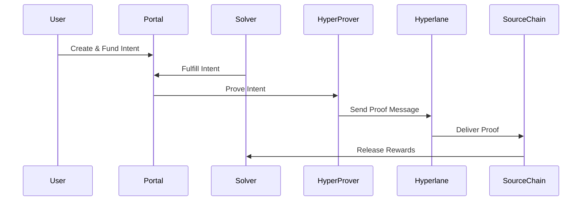

# Eco Routes SVM

A cross-chain intent protocol built on Solana, enabling users to create intents that are fulfilled by solvers across different blockchain networks. This implementation uses Hyperlane for cross-chain message passing and follows the ERC-7683 intent standard.

## Table of Contents

- [Architecture Overview](#architecture-overview)
- [Setup & Installation](#setup--installation)
- [Development Commands](#development-commands)
- [Programs](#programs)
- [Testing](#testing)
- [Deployment](#deployment)
- [Contributing](#contributing)

## Architecture Overview

### Core Components

#### **Portal Program** (`programs/portal/`)
The main intent protocol that manages the complete intent lifecycle:

- **Intent Creation**: Users define cross-chain operations with specific parameters
- **Intent Funding**: Users escrow reward tokens to incentivize solver execution
- **Intent Fulfillment**: Solvers execute the requested operations and provide proof
- **Proof Validation**: Validates fulfillment proofs from destination chains
- **Reward Settlement**: Distributes rewards to successful solvers

#### **Hyper-Prover Program** (`programs/hyper-prover/`)
A specialized prover that integrates with Hyperlane for cross-chain proof delivery:

- **Proof Generation**: Creates cryptographic proofs of intent fulfillment
- **Cross-Chain Messaging**: Uses Hyperlane to send proofs to source chains
- **Message Validation**: Implements ISM (Interchain Security Module) for security
- **Account Management**: Manages proof accounts and cleanup operations

### How They Work Together



1. **Intent Lifecycle**: Portal manages the full intent creation, funding, and fulfillment process
2. **Cross-Chain Proof**: HyperProver generates and transmits proof of fulfillment to origin chains
3. **Security**: Hyperlane's ISM validates cross-chain messages for security
4. **Cleanup**: Proof accounts are closed after successful validation to reclaim rent

### Key Features

- **ERC-7683 Compatibility**: Follows the standard intent protocol interface
- **Multi-Chain Support**: Works with any Hyperlane-supported blockchain
- **Solver Incentives**: Reward-based system encourages solver participation
- **Gas Optimization**: Efficient account management and rent reclamation
- **Security**: Multi-layered validation through Portal and Hyperlane

## Setup & Installation

### Prerequisites

Install the required toolchain components:

#### 1. Install Rust
```bash
curl --proto '=https' --tlsv1.2 -sSf https://sh.rustup.rs | sh
source ~/.cargo/env
```

#### 2. Install Solana CLI
```bash
sh -c "$(curl -sSfL https://release.solana.com/v1.18.26/install)"
export PATH="~/.local/share/solana/install/active_release/bin:$PATH"
```

#### 3. Install Anchor CLI
```bash
cargo install --git https://github.com/coral-xyz/anchor avm --force
avm install 0.31.1
avm use 0.31.1
```

#### 4. Install Additional Tools
```bash
# For import sorting
cargo install cargo-sort

# For golden file testing
cargo install goldie

# Set Rust toolchain
rustup toolchain install 1.85.1
rustup default 1.85.1
```

### Project Setup

#### 1. Clone and Setup
```bash
git clone <repository-url>
cd eco-routes-svm
```

#### 2. Configure Solana
```bash
# Set to localnet for development
solana config set --url localhost

# Generate keypair if needed
solana-keygen new
```

#### 3. Build the Project
```bash
anchor build
```

## Development Commands

### Building
```bash
# Build all programs (localnet/devnet)
anchor build

# Build with mainnet feature (REQUIRED for mainnet deployment)
anchor build --features mainnet

# Build specific program
anchor build --program portal
```

### Testing
```bash
# Run all tests (unit + integration)
anchor test

# Run only unit tests
cargo test

# Run integration tests only
cargo test --package integration-tests

# Run specific test file
cargo test --test prove_hyper_prover

# Run with test output
cargo test -- --nocapture
```

### Code Quality (PR Checks)

Run these commands to ensure your PR passes all checks:

```bash
# Format code
cargo +nightly fmt

# Sort imports
cargo sort --workspace

# Run clippy linting
cargo clippy --all-targets --all-features -- -D warnings

# Run all tests
anchor test

# Update golden files (if needed)
cargo test -- --goldie=overwrite
```

### Development Workflow
```bash
# Start local validator
solana-test-validator

# Deploy programs
anchor deploy

# Run integration tests against deployed programs
anchor test --skip-deploy
```

## Programs

### Portal Program

**Program ID**: `8zy9vW3HKKvBNgV6UKdGKFZDyY9J7r1cN5jcYd2mwGFA` (localnet)

#### Key Instructions:
- `fund_intent` - Fund an intent with reward tokens
- `fulfill_intent` - Execute intent operations and mark as fulfilled
- `prove_intent` - Submit proof of fulfillment from destination chain
- `refund_intent` - Refund intent if not fulfilled within timeout
- `withdraw` - Withdraw rewards after successful proof validation

#### Key Accounts:
- `FulfillMarker` - Tracks intent fulfillment status
- `WithdrawnMarker` - Prevents double withdrawals

### Hyper-Prover Program

**Program ID**: `B4pMQaAGPZ7Mza9XnDxJfXZ1cUa4aa67zrNkv8zYAjx4` (localnet)

#### Key Instructions:
- `init` - Initialize prover with whitelisted senders
- `handle` - Process incoming Hyperlane messages and create proofs
- `prove` - Generate and send proof via Hyperlane
- `close_proof` - Clean up proof accounts after validation

#### Key Accounts:
- `ProofAccount` - Stores proof data for intent fulfillment
- `Config` - Prover configuration and whitelisted senders

### Dummy ISM Program

**Program ID**: Used for testing Hyperlane integration

A simplified ISM implementation for testing cross-chain message validation.

## Testing

### Test Structure

- **Unit Tests**: Located in `#[cfg(test)]` modules within source files
- **Integration Tests**: Located in `integration-tests/tests/`
- **Golden Tests**: Used for consistent output validation

### Test Categories

#### Integration Tests:
- `fulfill.rs` - Intent fulfillment workflows
- `prove.rs` - Cross-chain proof generation
- `prove_hyper_prover.rs` - Direct hyper-prover testing
- `close_proof_hyper_prover.rs` - Proof cleanup testing
- `withdraw.rs` - Reward withdrawal flows

#### Test Patterns:
```rust
#[test]
fn test_intent_fulfillment() {
    let mut ctx = common::Context::default();

    // Setup intent and accounts
    let intent = ctx.rand_intent();

    // Execute fulfillment
    let result = ctx.fulfill_intent(/* params */);

    // Verify success
    assert!(result.is_ok());
}
```

### Running Specific Tests

```bash
# Run portal-specific tests
cargo test fulfill

# Run hyper-prover tests
cargo test prove_hyper_prover

# Run with specific pattern
cargo test invalid_dispatcher
```

## Deployment

### ⚠️ CRITICAL: Mainnet Feature Flag

**IMPORTANT**: When deploying to mainnet, you **MUST** use the `mainnet` feature flag. This changes critical program configurations including Hyperlane mailbox addresses and other network-specific settings.

#### ❌ Wrong (Will fail on mainnet):
```bash
anchor build                    # Missing feature flag!
anchor deploy --provider.cluster mainnet
```

#### ✅ Correct (Required for mainnet):
```bash
anchor build --features mainnet    # REQUIRED for mainnet
anchor deploy --provider.cluster mainnet
```

### Feature Flag Details

The `mainnet` feature flag affects both programs:

#### Portal Program (`programs/portal/Cargo.toml`):
```toml
[features]
mainnet = []
```

#### Hyper-Prover Program (`programs/hyper-prover/Cargo.toml`):
```toml
[features]
mainnet = []
```

When `mainnet` feature is enabled, it changes:
- Hyperlane mailbox program addresses
- Network-specific configurations
- Security parameters

### Deployment Commands

#### Localnet/Devnet (Development):
```bash
# Build without mainnet feature
anchor build

# Deploy to localnet
anchor deploy

# Deploy to devnet
anchor deploy --provider.cluster devnet
```

#### Mainnet (Production):
```bash
# Step 1: Build with mainnet feature (REQUIRED)
anchor build --features mainnet

# Step 2: Deploy to mainnet
anchor deploy --provider.cluster mainnet
```

### Environment Configuration

Update `Anchor.toml` for different environments:

```toml
[provider]
cluster = "localnet"  # or "devnet", "mainnet"
wallet = "~/.config/solana/id.json"
```

## Contributing

### Code Standards

1. **Formatting**: Use `cargo +nightly fmt`
2. **Import Sorting**: Use `cargo sort --workspace`
3. **Linting**: Pass `cargo clippy` without warnings
4. **Testing**: All tests must pass
5. **Documentation**: Document public APIs and complex logic

### Pull Request Checklist

- [ ] Code formatted (`cargo +nightly fmt`)
- [ ] Imports sorted (`cargo sort --workspace`)
- [ ] Clippy warnings resolved (`cargo clippy --all-targets`)
- [ ] All tests passing (`anchor test`)
- [ ] Golden files updated if needed (`cargo test -- --goldie=overwrite`)
- [ ] Documentation updated for API changes

### Adding New Tests

Follow existing patterns in `integration-tests/tests/`:

1. Create test files with descriptive names
2. Use `common::Context` for test setup
3. Test both success and failure cases
4. Follow error validation patterns with `common::is_error()`

### Feature Development

1. **Programs**: Add new instructions in respective `instructions/` directories
2. **Cross-Program Calls**: Use CPI patterns established in existing code
3. **Testing**: Add comprehensive integration tests for new features
4. **Documentation**: Update README and inline documentation

---

## Support

For questions or issues:
1. Check existing GitHub issues
2. Review test files for usage examples
3. Examine the workspace CLAUDE.md for detailed technical context

This project implements a production-ready cross-chain intent protocol with comprehensive testing and development tooling. The modular architecture allows for easy extension and customization while maintaining security and efficiency.
