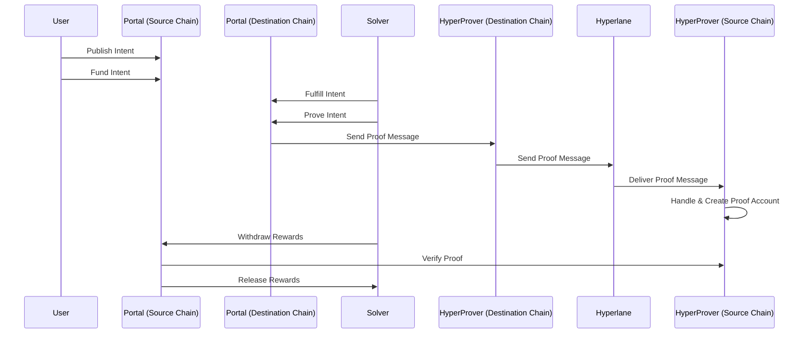

# Eco Routes SVM

A cross-chain intent protocol built on Solana, enabling users to create intents that are fulfilled by solvers across different blockchain networks. This implementation uses Hyperlane for cross-chain message passing.

## Table of Contents

- [Security](#security)
- [Architecture Overview](#architecture-overview)
- [Setup & Installation](#setup--installation)
- [Development Commands](#development-commands)
- [Programs](#programs)
- [Testing](#testing)
- [Deployment](#deployment)
- [Release](#release)
- [Contributing](#contributing)

## Security

The programs in this repository are **deployed on-chain and custody user funds.** A
vulnerability that becomes public before it is fixed can be exploited immediately and
irreversibly — public disclosure of an unpatched bug is itself the attack.

**If you find a security vulnerability, report it privately. Do not open a public pull
request, push a branch, or open a public issue.** Report it through the
[**Security tab → "Report a vulnerability"**](https://github.com/eco/eco-routes-svm/security),
which opens a private advisory visible only to you and the maintainers. Because it is
often unclear whether affected code is already deployed, treat **any** security fix as
sensitive until a maintainer confirms the code is not deployed.

See [`SECURITY.md`](./SECURITY.md) for the full policy, including specific instructions
for AI coding agents. This applies to humans and automated tools alike.

## Architecture Overview

### Core Components

#### **Portal Program** (`programs/portal/`)
The main intent protocol that manages the complete intent lifecycle:

- **Intent Creation**: Users define cross-chain operations with specific parameters
- **Intent Funding**: Users escrow reward tokens to incentivize solver execution
- **Intent Fulfillment**: Solvers execute the requested operations and provide proof
- **Proof Validation**: Validates fulfillment proofs from destination chains
- **Reward Settlement**: Distributes rewards to successful solvers

#### **Hyper-Prover Program** (`programs/hyper-prover/`)
A specialized program that integrates with Hyperlane for cross-chain message delivery:

- **Cross-Chain Messaging**: Uses Hyperlane to send fulfillment notifications to source chains
- **Message Validation**: Uses Hyperlane's default ISM (Interchain Security Module) for message security — the prover does not configure a custom ISM, so the mailbox's default ISM is used for all incoming messages
- **Account Management**: Manages proof accounts and cleanup operations

#### **Polymer-Prover Program** (`programs/polymer-prover/`)
A pull-based prover backed by Polymer's proof network:

- **Proof Validation**: Permissionless `validate` CPIs Polymer's `validate_event` and reads the freshly-written result account in the same instruction, then mirrors the Solidity `PolymerProver.validate` checks before creating idempotent `Proof` PDAs
- **Reverse Direction**: `prove` emits a `Prove: program: <id>, <hex>` log per intent for the EVM `PolymerProver.validateSolana` side to parse (at most 24 intents per call; see the `prove` note under [Polymer-Prover Program](#polymer-prover-program) for the per-transaction log budget)
- **Proof Cleanup**: Called back by Portal during `withdraw` to close the Proof PDA and reclaim rent

#### **LayerZero-Prover Program** (`programs/layerzero-prover/`)
A LayerZero V2-backed prover, both directions, intended as a liveness member of the 1-of-N aggregator. Outbound is two steps (`prove` then a permissionless `send_message`) and inbound follows LayerZero's executor V2 flow; see [LayerZero-Prover Program](#layerzero-prover-program).

#### **Local-Prover Program** (`programs/local-prover/`)
A prover for same-chain intents (Solana source and destination):

- **Proof Creation**: Accepts either Portal's or Flash-Fulfiller's prover-scoped prove authority as the authorized caller
- **Proof Cleanup**: Called back by Portal during `withdraw` to close the Proof PDA and reclaim rent

#### **Flash-Fulfiller Program** (`programs/flash-fulfiller/`)
An atomic orchestrator that lets solvers fulfill intents with zero capital — the reward funds the fulfillment in a single transaction:

- **Atomic Flow**: CPIs `local_prover.prove` → `portal.withdraw` → `portal.fulfill` → sweep leftover tokens and SOL to a claimant
- **Flash Vault PDA**: Acts as the transient intermediary; owns ATAs during execution and is drained at the end
- **Optional Intent Buffer**: `set_flash_fulfill_intent` stores a full route + reward under a PDA so callers can later invoke `flash_fulfill` with just the intent hash

### How They Work Together

The optional **Aggregator-Prover** (`programs/aggregator-prover/`) forwards proof validation and cleanup to an immutable set of concrete provers. Solvers deliver a concrete proof and withdraw through the aggregator, with no aggregation transaction or aggregate proof PDA.


```mermaid
sequenceDiagram
    participant User
    participant SourcePortal as Portal (Source Chain)
    participant DestPortal as Portal (Destination Chain)
    participant Solver
    participant DestProver as HyperProver (Destination Chain)
    participant Hyperlane
    participant SourceProver as HyperProver (Source Chain)

    User->>SourcePortal: Publish Intent
    User->>SourcePortal: Fund Intent
    Solver->>DestPortal: Fulfill Intent
    Solver->>DestPortal: Prove Intent
    DestPortal->>DestProver: Send Proof Message
    DestProver->>Hyperlane: Send Proof Message
    Hyperlane->>SourceProver: Deliver Proof Message
    SourceProver->>SourceProver: Handle & Create Proof Account
    Solver->>SourcePortal: Withdraw Rewards
    SourcePortal->>SourceProver: Verify Proof
    SourcePortal->>Solver: Release Rewards
```

1. **Intent Lifecycle**: Portal manages the full intent creation, funding, and fulfillment process
2. **Cross-Chain Messaging**: HyperProver handles Hyperlane message passing for proof delivery
3. **Security**: Hyperlane's **default ISM** validates cross-chain messages — the HyperProver returns `None` for its ISM, deferring to the mailbox's configured default ISM
4. **Cleanup**: Proof accounts are closed after successful validation to reclaim rent

### Key Features

- **Multi-Chain Support**: Works with any Hyperlane-supported blockchain
- **Solver Incentives**: Reward-based system encourages solver participation
- **Gas Optimization**: Efficient account management and rent reclamation
- **Security**: Multi-layered validation through Portal and Hyperlane

## Setup & Installation

### Prerequisites

Install the required toolchain components:

#### 1. Install Rust
```bash
curl --proto '=https' --tlsv1.2 -sSf https://sh.rustup.rs | sh
source ~/.cargo/env
```

#### 2. Install Solana CLI
```bash
sh -c "$(curl -sSfL https://release.anza.xyz/v4.1.1/install)"
export PATH="~/.local/share/solana/install/active_release/bin:$PATH"
```

Use this exact version. CI pins it (`SOLANA_VERSION` in `.github/workflows/`) so the CLI
tooling matches a release build. Note it does **not** decide which rustc compiles the on-chain
programs — anchor-cli 1.x hard-codes `--tools-version v1.52` (rustc 1.89.0-dev) when invoking
`cargo build-sbf`, so the Anchor version is what moves the bytecode compiler.

#### 3. Install Anchor CLI
```bash
cargo install --git https://github.com/coral-xyz/anchor avm --force
avm install 1.1.2
avm use 1.1.2
```

#### 4. Install Additional Tools
```bash
# For import sorting
cargo install cargo-sort

# For golden file testing
cargo install goldie

# Set Rust toolchain
rustup toolchain install 1.97.1
rustup default 1.97.1
```

### Project Setup

#### 1. Clone and Setup
```bash
git clone <repository-url>
cd eco-routes-svm
```

#### 2. Configure Solana
```bash
# Set to localnet for development
solana config set --url localhost

# Generate keypair if needed
solana-keygen new
```

#### 3. Build the Project
```bash
anchor build
```

## Development Commands

### Building
```bash
# Build all programs (localnet - includes dummy-ism for testing)
anchor run build-localnet

# Build for devnet (excludes dummy-ism)
anchor run build-devnet

# Build with mainnet feature (REQUIRED for mainnet deployment)
anchor run build-mainnet

# Build specific program
anchor build --program portal
```

### Testing
```bash
# Run all tests (unit + integration)
anchor test

# Run only unit tests
cargo test

# Run integration tests only
cargo test --package integration-tests

# Run specific test file
cargo test --test prove_hyper_prover

# Run with test output
cargo test -- --nocapture
```

### Code Quality (PR Checks)

Run these commands to ensure your PR passes all checks:

```bash
# Format code
cargo +nightly fmt

# Sort imports
cargo sort --workspace

# Run clippy linting (do NOT pass --all-features; portal's cpi feature has broken Anchor codegen)
cargo clippy --all-targets -- -D warnings

# Run all tests
anchor test

# Update golden files (if needed)
GOLDIE_UPDATE=1 cargo test

# The deployer is its own workspace; its tests load target/deploy, so build first
cargo +nightly fmt --all --manifest-path packages/deployer/Cargo.toml
cargo sort packages/deployer
cargo clippy --manifest-path packages/deployer/Cargo.toml --all-targets -- -D warnings
cargo test --manifest-path packages/deployer/Cargo.toml
```

### Available Anchor Scripts

```bash
# Build scripts
anchor run build-localnet   # Build for localnet (includes dummy-ism)
anchor run build-devnet     # Build for devnet (excludes dummy-ism)
anchor run build-mainnet    # Build for mainnet with mainnet feature

# Test script
anchor run test             # Run all tests
```

### Development Workflow
```bash
# Start local validator
solana-test-validator

# Build and deploy programs for localnet (includes dummy-ism for testing)
anchor run build-localnet
anchor deploy

# Or use all-in-one test command
anchor test

# Run integration tests against deployed programs
anchor test --skip-deploy
```

## Programs

### Portal Program

Proven cancellation changes the `refund` account layout and several errors and events; see [Proven Cancellation: Client-Visible Changes](docs/proven-cancellation.md) before integrating.

#### Key Instructions:
- `publish` - Create and emit intent on source chain
- `fund` - Fund an intent with reward tokens
- `fulfill` - Execute intent operations and mark as fulfilled
- `prove` - Submit proof of fulfillment from destination chain
- `refund` - Refund after the reward deadline with no applicable proof, on a proven cancellation, or after withdrawal. Portal determines the refund path from the withdrawal marker or returned proof. Refund creates no marker and leaves proofs intact. Each refund sweeps the token triples it is given; repeated refunds sweep the rest.
- `withdraw` - Validate the payout claimant through the prover, transfer rewards, and create the permanent withdrawal marker. Leaves proofs intact
- `close_proof` - Independently reclaim proof rent after withdrawal, or for a validated cancellation at/after the reward deadline
- `cancel` - After `route.deadline`, permanently cancel an unfulfilled intent on its destination. Permissionless. Writes a permanent `FulfillMarker` holding the `CANCELLED` sentinel (a hash-derived, unowned EVM address, byte-identical to EVM `Inbox.CANCELLED`) at the intent's fulfill-marker PDA; `prove` then carries it to the source, where `refund` succeeds before `reward.deadline`.

#### Key Accounts:
- `Vault` - Escrows reward tokens for intent funding
- `FulfillMarker` - Permanent record of an intent's outcome on its destination: the solver's claimant after `fulfill`, or `CANCELLED` after `cancel`. Never closed, so an intent can be fulfilled or cancelled, never both
- `WithdrawnMarker` - Prevents double withdrawals of rewards

### Hyper-Prover Program


#### Key Instructions:
- `init` - The program's upgrade authority initializes the prover once with whitelisted senders
- `handle` - Process incoming Hyperlane messages and create proof accounts
- `prove` - Send proof message via Hyperlane
- `get_proof` - Return `Option<Proof>` for the requested intent hash and destination
- `close_proof(args)` - Close the canonical proof with Portal’s intent-scoped authorization

#### Key Accounts:
- `ProofAccount` - Stores proof data for intent fulfillment
- `Config` - Prover configuration with whitelisted senders

### Polymer-Prover Program

A pull-based prover backed by Polymer's proof network. Unlike Hyper-Prover, nobody calls it directly — a relayer loads a Polymer proof into Polymer's program, then calls this program's permissionless `validate`.

#### Key Instructions:
- `init` - The program's upgrade authority initializes the prover once with whitelisted emitters
- `validate` - CPI Polymer's `validate_event`, mirror the Solidity `PolymerProver.validate` checks, and create a `Proof` PDA idempotently
- `prove` - Emit a `Prove: program: <id>, <hex>` log per intent for the EVM `PolymerProver.validateSolana` side to parse. Capped at 24 intents per call because Solana truncates a transaction's logs at 10 KB while the transaction still succeeds; that budget is shared by every instruction in the transaction, so submit `portal::prove` as the only log-emitting instruction in its transaction, then count the `Program log: Prove: program: <polymer_prover id>, ` lines in `meta.logMessages` against the hashes sent and resubmit any shortfall (`prove` writes no state, so the retry is safe)
- `get_proof` - Return `Option<Proof>` for the requested intent hash and destination
- `close_proof(args)` - Close the canonical proof with Portal’s intent-scoped authorization

#### Key Accounts:
- `ProofAccount` - Stores proof data for intent fulfillment
- `Config` - Prover configuration with whitelisted emitters

### LayerZero-Prover Program

A LayerZero V2-backed prover, both directions. It is a liveness member for the 1-of-N aggregator: a proof from any member is enough to settle.

#### Outbound (two-step)
- `prove` - Gated to Portal's `dispatcher_pda(&layerzero_prover::ID)`. It only commits the batch to a content-addressed `PendingSend` PDA.
- `send_message` - Permissionless and top-level. It CPIs the endpoint's `send`, which nests endpoint, ULN, worker and pricefeed and already fills Solana's 5-frame invoke stack, so it cannot run under `portal::prove` (SIMD-0268, raising the limit, was not active when this shipped).
- `quote_message` - Simulate it to get the fee.

Solvers send `[ComputeBudget, portal::prove, layerzero_prover::send_message]` in one v0 transaction with address lookup tables. A batch holds at most `MAX_INTENTS_PER_PROVE` intents (21, measured with that transaction shape; it uses 62 of the 64 account locks). Executor options are computed on-chain with the EVM gas floor (`200_000 + 50_000·n`).

The margin is thin. The cap assumes one address lookup table and at most 4 DVNs per path; a second lookup table pushes 21 intents over the 1232-byte packet limit. The fallback is to send `portal::prove` and `send_message` in separate transactions; the `PendingSend` commit persists between them.

#### Inbound (executor V2)
- `lz_receive_types_info` and `lz_receive_types_v2` - Executor discovery. `lz_receive_types_info` returns `[store, alt]`, the accounts `lz_receive_types_v2` takes. `lz_receive_types_v2` returns `lz_receive_accounts` (the single source of the account list) compacted against the lookup table the way LayerZero's `compact_accounts_with_alts` does: every account in the table becomes an `AltIndex` locator, and only the per-message `PayloadHash` and `Proof` PDAs stay plain addresses.
- `lz_receive` - CPIs `endpoint::clear` first, checks `sender == peer[src_eid].address` and `ProofData.destination == peer.chain_id`, then creates `Proof` PDAs (identical redelivery is a no-op, a conflicting proof fails with `IntentAlreadyProven`).

EVM `Inbox.prove` batches toward Solana must stay at or below `MAX_PAIRS_PER_MESSAGE` (7, measured against a modelled executor delivery transaction; to be confirmed on the devnet E2E). The EVM contract cannot enforce this and an over-cap message can never execute, so re-prove with a smaller batch.

The cap of 7 assumes the executor resolves every static `lz_receive` account through the lookup table recorded by `set_alt`. That table must hold every address `required_alt_addresses` returns: the `Store` PDA, `pda_payer`, the system program, this program's event authority and ID, the endpoint program, the OApp registry, the endpoint settings and event authority, and the endpoint `Nonce` of every configured peer. `set_alt` checks this on-chain and also requires the table to be frozen (no authority) and never deactivated, failing with `InvalidLookupTable`, `LookupTableNotFrozen`, `LookupTableDeactivated` or `LookupTableMissingAddress`. Until a table is recorded, `lz_receive_types_v2` fails with `AltNotSet`.

#### Proof query and cleanup
- `get_proof` - Return `Option<Proof>` for the requested intent hash and destination. Portal's `withdraw` and `refund` (and the aggregator) query it with the tail `[proof]`; query data is ignored.
- `close_proof(args)` - Close the canonical proof with Portal's intent-scoped authorization. Portal's `close_proof` calls it after withdrawal, or for a cancellation at/after the reward deadline, with the cleanup tail `[proof, pda_payer]`; the rent goes back to `pda_payer`, which paid it in `lz_receive`. `withdraw` no longer closes the proof, so cleanup is a separate (permissionless) call.

#### Funding
Proof rent comes from the `pda_payer` reserve because the EVM sender's options carry gas only. An empty reserve makes delivery fail retryably, so monitor its balance. The rent only comes back when Portal's `close_proof` runs for the intent, and nobody but the reserve profits from it, so bundle cleanup with `withdraw` or run it from an operator job; otherwise every settled proof stays a permanent drain on the reserve. `pda_payer` must also be pre-funded before `init_path` / `set_path_config`, since it pays endpoint and ULN rent as the LayerZero delegate.

#### EVM-side configuration
- Whitelist the program's **`Store` PDA** on the EVM `LayerZeroProver` — it is the OApp address LayerZero reports as `origin.sender` — not the program ID.
- Map Solana's EID (30168 mainnet / 40168 devnet) to `CHAIN_ID`.

#### Administration and finalization
`pda_payer` is the LayerZero delegate. `init`, `init_path`, `set_path_config` and `set_alt` are gated on the program's upgrade authority, so finalizing the program is the delegate revocation. Every path must be fully pinned (ULN302 send/receive library, explicit DVNs, confirmations, executor; `set_path_config` rejects LayerZero defaults and `NIL_CONFIRMATIONS`, which ULN302 resolves to zero confirmations) and read back before finalizing. An unpinned path after finalization needs a new program ID.
- `set_path_config` runs ULN302 `init_config`, which creates the per-OApp Send/ReceiveConfig accounts, so on a real chain it is one-shot per eid. A wrong config must be corrected by a program upgrade before finalizing, then read back again.
- The lookup table recorded by `set_alt` must be frozen (authority removed) and complete (`required_alt_addresses`) before `set_alt`, which rejects anything else. After finalizing, `set_alt` can never replace it.

**Finalization gate.** Before finalizing the program, run one real outbound `send_message` and one inbound executor delivery on every configured mainnet path, then read back every path's `Nonce`, send and receive library, and ULN send/receive and executor config. CI verifies the ULN302 `init_config`/`set_config` account tails, `SendParams`/`QuoteParams` and the `send` account head only against the mock endpoint, so these mainnet runs are the only check against the real programs.

`layerzero.rs` hand-mirrors LayerZero-v2@9c741e7f (endpoint and ULN IDs, big-endian seeds, discriminators, V2 executor types). The ignored `layerzero_prover_real` test (needs `LZ_ENDPOINT_SO`) checks it against the dumped endpoint binary.

### Local-Prover Program

A prover implementation for same-chain intents (e.g., Solana to Solana transactions).

#### Key Instructions:
- `prove` - Create Proof accounts (called by Portal's dispatcher PDA or Flash-Fulfiller's vault PDA)
- `get_proof` - Return `Option<Proof>` for the requested intent hash and destination
- `close_proof(args)` - Close the canonical proof with Portal’s intent-scoped authorization; rent goes to the signing payer

### Flash-Fulfiller Program

Atomic flash-fulfillment orchestrator for same-chain solvers.

#### Key Instructions:
- `set_flash_fulfill_intent` - Pre-store a route + reward under a PDA indexed by intent hash
- `flash_fulfill` - Atomically prove, withdraw, fulfill, and sweep leftovers to a user-supplied claimant

#### Key Accounts:
- `FlashFulfillIntentAccount` - Optional buffer holding the route + reward for hash-based invocation
- `flash_vault` - Program-owned PDA that holds rewards and acts as solver/claimant during the atomic flow

### Proof-Helper Program

A helper program used by Hyperlane message construction in tests and off-chain tooling.

### Aggregator-Prover Program

- `init()` — the upgrade authority initializes immutable `Config` once with 1–8 unique executable prover IDs. A different set requires another deployment.
- `get_proof(args)` — query any subset of configured members in caller order using variable-length account groups; return the first proof, or `None` only if every configured member was queried and has none.
- `close_proof(args)` — forward Portal's intent-scoped signer to every supplied member; each leaf closes its own proof and applies its rent-recipient policy.

The aggregator has no `aggregate`, `prove`, proof account or proof event. Destination dispatch and source delivery use concrete provers. A returned fulfillment proof blocks refund until withdrawal; cancellation evidence permits immediate refund. Listeners track concrete prover events and identify the member when requesting settlement.

The trust floor is the weakest configured prover. Initialize and review the exact member set before finalizing deployment; executable status alone does not establish trust or interface compatibility. Members supply their own account layouts and query data; account groups have explicit lengths.

See [Proof queries and cleanup](docs/prover-interface.md) for account order, proof query semantics, refund paths and the breaking client changes.

## Testing

### Test Structure

- **Unit Tests**: Located in `#[cfg(test)]` modules within source files
- **Integration Tests**: Located in `integration-tests/tests/`
- **Golden Tests**: Used for consistent output validation

### Test Categories

#### Integration Tests:
- `publish.rs` - Intent creation and publishing
- `fund.rs` - Intent funding workflows
- `fulfill.rs` - Intent fulfillment workflows
- `prove_hyper_prover.rs` - HyperProver proof generation
- `prove_local_prover.rs` - LocalProver proof generation
- `withdraw.rs` - Reward withdrawal flows
- `refund.rs` - Intent refund workflows
- `handle.rs` - Hyperlane message handling
- `close_proof_hyper_prover.rs` - HyperProver proof cleanup
- `close_proof_local_prover.rs` - LocalProver proof cleanup
- `init_hyper_prover.rs` - HyperProver initialization
- `aggregator_prover.rs` - Prover configuration, generated event IDL, Hyperlane delivery and Polymer validation through aggregation and Portal withdrawal (native/SPL/Token-2022), competing proofs, and atomic Polymer validation/aggregation. Bridge verification uses the local dummy ISM and mock Polymer program.
- `flash_fulfill.rs` - Atomic flash-fulfillment flows
- `set_flash_fulfill_intent.rs` - Flash-fulfillment intent buffer writes
- `pay_for_gas.rs` - Hyperlane gas payment via proof-helper
- `init_polymer_prover.rs` - PolymerProver initialization
- `validate_polymer_prover.rs` - PolymerProver proof validation
- `prove_polymer_prover.rs` - PolymerProver reverse-direction log emission
- `close_proof_polymer_prover.rs` - PolymerProver proof cleanup
- `validate_polymer_prover_real.rs` - Ignored smoke test against Polymer's real deployed program
- `init_layerzero_prover.rs`, `prove_layerzero_prover.rs`, `send_layerzero_prover.rs`, `lz_receive_layerzero_prover.rs`, `lz_receive_types_layerzero_prover.rs`, `close_proof_layerzero_prover.rs` - LayerZeroProver admin, outbound commit/send, inbound executor flow, receive-types discovery, `get_proof` (direct and through the aggregator) and Portal `close_proof` cleanup (against `mock-layerzero-endpoint`)
- `layerzero_prover_batch_limits.rs` - Pins the outbound and inbound batch ceilings
- `layerzero_prover_real.rs` - Ignored test (needs `LZ_ENDPOINT_SO`) checking the hand-mirrored endpoint CPIs against LayerZero's dumped deployed binary

#### Test Patterns:
```rust
#[test]
fn test_intent_fulfillment() {
    let mut ctx = common::Context::default();

    // Setup intent and accounts
    let intent = ctx.rand_intent();

    // Execute fulfillment
    let result = ctx.fulfill_intent(&intent);

    // Verify success
    assert!(result.is_ok());
}
```

### Running Specific Tests

```bash
# Run portal-specific tests
cargo test fulfill

# Run hyper-prover tests
cargo test prove_hyper_prover

# Run with specific pattern
cargo test invalid_dispatcher
```

## Deployment

### ⚠️ CRITICAL: Mainnet Feature Flag

**IMPORTANT**: When deploying to mainnet, you **MUST** use the `mainnet` feature flag. This changes critical program configurations including Hyperlane mailbox addresses and other network-specific settings.

#### ❌ Wrong (Will fail on mainnet):
```bash
anchor build                    # Missing feature flag!
anchor deploy --provider.cluster mainnet
```

#### ✅ Correct (Required for mainnet):
```bash
anchor build --features mainnet    # REQUIRED for mainnet
anchor deploy --provider.cluster mainnet
```

### Feature Flag Details

The `mainnet` feature flag is defined on every production program (`portal`, `hyper-prover`, `local-prover`, `aggregator-prover`, `flash-fulfiller`, `proof-helper`, `polymer-prover`, `layerzero-prover`):

```toml
[features]
mainnet = []
```

When `mainnet` feature is enabled, it changes:
- Hyperlane mailbox program addresses
- Network-specific configurations
- Security parameters

### Deployment Commands

#### Localnet (Development):
```bash
# Build and deploy for localnet (includes dummy-ism for testing)
anchor run build-localnet
anchor deploy

# Or use cluster-specific deployment
anchor deploy --provider.cluster localnet
```

#### Devnet and Mainnet

The committed `declare_id!`s are placeholders, so devnet and mainnet deploy only from a release. Follow [Deploying a release](#deploying-a-release).

#### Network-Specific Program Configuration

The `Anchor.toml` file includes network-specific program configurations:

- **Localnet**: Includes the localnet-only test programs — `dummy-ism`, `mock-polymer-prover`, `mock-layerzero-endpoint`, `malicious-prover`, `malicious-proof-closer`
- **Devnet** / **Mainnet**: Exclude the localnet-only test programs (production-like / production only)

What keeps them out of devnet/mainnet artifacts is not the `[programs.<cluster>]` registration — that only maps names to IDs — but the explicit `--program-name` enumeration in `Anchor.toml`'s `build-devnet` / `build-mainnet` scripts and the `RELEASED_PROGRAMS` list `release.yml` copies assets by.

```toml
[programs.localnet]
aggregator-prover = "..."
dummy-ism = "..."              # localnet-only test program
mock-polymer-prover = "..."    # localnet-only test program
mock-layerzero-endpoint = "..."  # localnet-only test program
malicious-prover = "..."       # localnet-only test program
malicious-proof-closer = "..." # localnet-only test program
flash-fulfiller = "..."
hyper-prover = "..."
local-prover = "..."
polymer-prover = "..."
layerzero-prover = "..."
portal = "..."
proof-helper = "..."

[programs.devnet]
aggregator-prover = "..."
flash-fulfiller = "..."
hyper-prover = "..."
local-prover = "..."
polymer-prover = "..."
layerzero-prover = "..."
portal = "..."
proof-helper = "..."
# localnet-only test programs excluded

[programs.mainnet]
aggregator-prover = "..."
flash-fulfiller = "..."
hyper-prover = "..."
local-prover = "..."
polymer-prover = "..."
layerzero-prover = "..."
portal = "..."
proof-helper = "..."
# localnet-only test programs excluded
```

### Environment Configuration

Update `Anchor.toml` for different environments:

```toml
[provider]
cluster = "localnet"  # or "devnet", "mainnet"
wallet = "~/.config/solana/id.json"
```

## Release

Releases are published via the manual `Release` GitHub Actions workflow (`.github/workflows/release.yml`) — there is **no auto-release on push to `main`**. To cut a release, open the Actions tab on GitHub, click **Run workflow** and untick **dry_run**. A dry run (the default) computes the version, derives the program IDs and builds every asset, but publishes nothing: no release, tags or branches. Either way the run summary shows the version and each program's address, and a dry run uploads the would-be assets (`.so` files, IDLs, `program-ids.json`, the script; never keypairs) as a workflow artifact. A dry run uses the same secret, so it needs the same `release` environment approval, and its addresses are exactly what a real release from that commit would publish.

### What gets published

Each release attaches every production program's bytecode (the verifiable build, from `solana-verify build` in the pinned image) and IDL, built once per cluster, as downloadable assets on the GitHub Release:

```
dist/program/mainnet/<program>.mainnet.so    dist/idl/mainnet/<program>.mainnet.json
dist/program/devnet/<program>.devnet.so      dist/idl/devnet/<program>.devnet.json
```

plus `program-ids.json`, recording each program's `address`, `seed` and `salt` (see [Program IDs](#program-ids)).

`<program>` is each of `portal`, `hyper_prover`, `local_prover`, `aggregator_prover`, `flash_fulfiller`, `proof_helper`, `polymer_prover` and `layerzero_prover`. Every program's bytecode depends on the `mainnet` feature, so deploy the `.mainnet.so` to mainnet and the `.devnet.so` to devnet. The `hyper_prover`, `polymer_prover` and `proof_helper` IDLs embed feature-gated addresses (Hyperlane mailbox, Polymer program, IGP); the other IDLs are identical across clusters but are published under both names for uniformity.

Assets are attached flat, so the downloadable names are the basenames above (e.g. `polymer_prover.mainnet.so`); the `.mainnet` / `.devnet` infix is what keeps the two sets from colliding.

### Program IDs

The `declare_id!`s in source are placeholders and never change. A release's real IDs are derived by `scripts/program-keypairs.mjs` (zero-dependency, Node 22) from the release secret, the program's lib name and a seed, then ground to an `Eco` prefix (about 57,000 attempts, ~1.5 s per program). Mainnet and devnet share the IDs. The seed hashes:

- the program's salt from `scripts/program-salts.json` (0 when absent);
- its placeholder build on both clusters;
- the seed of every released program whose ID it compiles in (its Cargo dependencies, followed through shared workspace crates) and, for the aggregator, of its members (`AGGREGATOR_MEMBERS` in the script; the deployer derives the same members, and both must equal the set passed to `init`).

So a program keeps its address while its bytecode and salt are unchanged, and anything that moves a program also moves everything that depends on it. A toolchain, Anchor, Solana or dependency bump changes bytecode, so it usually moves every program.

**Salts re-roll an address without a code change.** Raise a program's salt when its address must not be reused: its `init` config is wrong, or its configuration changes (whitelisted senders or emitters, aggregator members), since a live address keeps its original config forever. Only ever raise a salt: lowering it returns to an old address and its old config.

The release job builds the placeholders, derives the IDs (it writes no keys), rewrites every `declare_id!` on the runner, rebuilds, and checks each IDL's `address`. Bytecode is always built with `solana-verify build` in the image pinned by digest in `VERIFY_IMAGE` (`release.yml`), so the published `.so` files are exactly what `verify-from-repo` reproduces and what gets deployed; v2.1.1's mainnet programs are byte-identical to builds in that image. IDLs come from `anchor idl build`. Before publishing it pushes a `deploy/v<version>` tag: one commit on top of `v<version>` that only rewrites the `declare_id!`s (public keys), which `solana-verify verify-from-repo` rebuilds. `main` and the `releases/*` branches never contain it, and CI does not test it, since the PDA goldens are pinned to the placeholder IDs. Cargo.toml versions are not bumped before building, because a bump changes the bytecode of every dependent of `eco-svm-std`; the IDLs' `metadata.version` is set afterwards.

The secret is `PROGRAM_KEYPAIR_SECRET` (hex, at least 32 bytes, e.g. `openssl rand -hex 32`), stored in the `release` GitHub environment and the team vault. Anyone holding it can deploy at any release's addresses, and changing it moves every program. Repository settings that protect it:

- the `release` environment allows only `main` (or `releases/**` too, with a ruleset restricting who may create or update those branches), requires reviewers and prevents self-review;
- CODEOWNERS review is required for `.github/workflows/**`, `scripts/program-keypairs.mjs` and `scripts/program-salts.json`;
- a tag ruleset forbids updating or deleting `v*` and `deploy/*`.

### Deploying a release

The manual `Deploy` workflow (`.github/workflows/deploy.yml`) takes a published release to devnet or mainnet: each new program is deployed, initialized, read back, verified and made immutable, in that order. It runs twice: a dry run that only plans, then the same run with the reviewed `plan_hash`.

**Prerequisites**

- The release exists (`v<version>` and its `deploy/v<version>` tag) and the EVM provers it will trust are deployed, since their addresses are `init` inputs.
- The workflow builds the deployer and runs `scripts/deploy-step.sh` from that `deploy/v<version>` tag, not from `main`: a release cut before this pipeline existed cannot use it, and a fix to the pipeline reaches deploys only through a new release.
- GitHub environment `release` (shared with the release workflow and both clusters): required reviewers, self-review prevented, `main` only. Its approval is the second pair of eyes on every run, dry runs included.
- The deployer, `Cx92mzUNNr7mazZmuB5uTZtaYPNDFs6RwKVYF2hC7kH3`, holds SOL on the target cluster. A fresh deploy of every program takes about 20 SOL: about 16 SOL of program rent, locked for good once the programs are final, plus the largest buffer (refunded), the reserve top-ups and fees. The plan step estimates this from the release and the chain and fails if the balance is short.
- Environment secrets: `PROGRAM_KEYPAIR_SECRET` (the release secret), `DEPLOYER_KEYPAIR` (JSON keypair; pays and is every new program's upgrade authority until the last step), `ALCHEMY_API_KEY` (an Alchemy app with Solana mainnet and devnet enabled; the run uses `https://solana-<cluster>.g.alchemy.com/v2/<key>`). The RPC URL is redacted from logs and the uploaded artifact.

**Inputs**

| Input | Notes |
|---|---|
| `version` | Release version, no `v` |
| `cluster` | `devnet` or `mainnet`; selects the Alchemy endpoint |
| `plan_hash` | Empty or not equal to the computed hash: dry run, nothing is written |
| `hyper_senders` | Comma-separated EVM addresses (`0x` + 20 bytes) of the EVM HyperProver |
| `polymer_emitters` | Comma-separated EVM addresses of the EVM PolymerProver |
| `layerzero` | JSON, see below |
| `hyper_reserve_lamports`, `layerzero_reserve_lamports` | Top-ups for each prover's `pda_payer`, default `0`. Only the shortfall is sent; a balance is never reduced. The plan fails unless the LayerZero reserve covers the endpoint and ULN accounts its paths still need (about 0.036 SOL per peer) and stays rent-exempt; the summary shows both |
| `finalize_layerzero` | Default `false`; see [Finalizing LayerZero](#finalizing-layerzero) |
| `compute_unit_price` | Micro-lamports per compute unit for deploys and init transactions, default `0` (none) |

Inputs for a program that is already live are not written, but are still hashed and compared with its on-chain config. The plan also rejects any input the program's own `init` would: more than 20 hyper senders or Polymer emitters, and a LayerZero peer with a zero `eid`, `chain_id` or address, or a `chain_id` another peer already uses.

`layerzero` lists one peer per EVM chain. `required_dvn_count` must equal `required_dvns`; `optional_dvn_count` `255` means no optional DVNs (`0` would fall back to LayerZero's defaults and is rejected). DVN lists must be strictly ascending by public key, or the plan is rejected:

```json
{
  "peers": [
    {
      "eid": 30184,
      "address": "0x1111111111111111111111111111111111111111",
      "chain_id": 8453,
      "path": {
        "send_uln": {
          "confirmations": 15,
          "required_dvn_count": 2,
          "optional_dvn_count": 255,
          "optional_dvn_threshold": 0,
          "required_dvns": [
            "11111111111111111111111111111112",
            "11111111111111111111111111111113"
          ],
          "optional_dvns": []
        },
        "receive_uln": {
          "confirmations": 15,
          "required_dvn_count": 2,
          "optional_dvn_count": 255,
          "optional_dvn_threshold": 0,
          "required_dvns": [
            "11111111111111111111111111111112",
            "11111111111111111111111111111113"
          ],
          "optional_dvns": []
        },
        "executor": {
          "max_message_size": 10000,
          "executor": "11111111111111111111111111111114"
        }
      }
    }
  ]
}
```

The addresses above are placeholders; use the DVN and executor addresses LayerZero publishes for the Solana pathway to that peer.

**1. Dry run.** Run the workflow with the inputs and an empty `plan_hash`. It checks the release (each `declare_id!` and IDL `address` against `program-ids.json`), refuses an RPC whose genesis hash is not the selected cluster's (devnet and mainnet share program IDs), classifies every program against the chain and writes the plan to the job summary, followed by the deployer's address, balance and estimated cost. Nothing is written on chain. A deployer short of SOL fails this step after printing the plan; fund it and rerun. Its balance is not part of the hash.

**2. Review the summary.** Check every program's status, the inputs as normalized, and the actions planned (deploy, init steps, verify, finalize). Statuses:

| Status | On chain | Plan |
|---|---|---|
| New | no account | deploy, initialize, verify, finalize |
| Partial | bytecode equals the release, authority is the deployer | resume: finish what is missing, then verify and finalize |
| Live | bytecode equals the release, immutable, config equal to the inputs | skip |
| Foreign | anything else, including lamports someone sent to the program or programdata address | the run fails: someone else holds the address, and the other programs would trust it |

The hash covers the release, the binaries, the cluster's genesis hash, the inputs and the on-chain facts the plan used. Copy `plan_hash` from the summary.

**3. Execute.** Run again with the same inputs and `plan_hash`. After the reviewers approve, the run re-plans and continues only if the hash is unchanged. It then:

1. derives the program keypairs and deploys each new program (upgrade authority: the deployer);
2. funds the reserves, then runs the `init` steps, each skipped when its account already exists and matches: `hyper_prover`, `polymer_prover`, `aggregator_prover` (members `hyper_prover`, `polymer_prover`, `layerzero_prover`, taken from the release), then LayerZero (`init`, `init_path` and `set_path_config` per peer, the lookup table, `set_alt`). Every `init` needs the upgrade authority, so none can run after a program is final;
3. reads every config back and compares it with the inputs; any difference fails the run with every program still upgradeable;
4. verifies each program with `solana-verify` (and submits the remote job on mainnet);
5. makes each program immutable, except `layerzero_prover`;
6. deletes the keys and uploads the deploy record (`plan.json` and the logs; `apply.log` lists every config as read back) as artifact `deploy-v<version>-<cluster>`.

#### Finalizing LayerZero

`layerzero_prover` stays upgradeable after the run: finalizing it revokes the `pda_payer` delegate, which must wait for the manual gate in [Administration and finalization](#administration-and-finalization). After the gate, run the workflow with the same inputs plus `finalize_layerzero: true`, review its plan and execute it with the new hash. The plan refuses unless the full LayerZero setup is on chain and equal to the inputs.

#### Recovery

- **Failed or cancelled run.** Programs stay upgradeable. A deploy that died part-way leaves a buffer holding its rent; the run closes every buffer the deployer owns before it deploys and again at the end, whatever the outcome, returning the rent to the deployer. Fix the cause and start from a fresh dry run: the earlier hash covered state that has since changed. Every step is idempotent, so the new plan only contains what is left.
- **Burned address.** If an immutable program has a missing or wrong config (or a config was set by someone else), or someone sent lamports to a new program's address or its programdata address (the loader then cannot create the account), the address is unusable. Raise the program's salt in `scripts/program-salts.json` and cut a new release; that moves it and everything depending on it.
- **Interrupted `solana program deploy` in the manual fallback.** It leaves a buffer account holding the upload's rent. Reclaim every buffer of the deployer with `solana program close --buffers -u <rpc> -k <deployer-keypair> --authority <deployer-keypair>`; the program itself does not exist yet, so the next plan lists it as new.
- **Abandoned deployment.** Prefer leaving its programs upgradeable. `solana program close <address> ... --bypass-warning` reclaims a program's rent but burns its address for good: the loader never redeploys a closed program ID, so a redeploy needs its salt raised and a new release. Lamports held by the program's PDAs are lost with it, because only the program can sign for them: the `hyper_prover` and `layerzero_prover` `pda_payer` reserves and the LayerZero `Store` and ULN config rent. Close a program only if that is acceptable.

#### Limits

| Limit | Value |
|---|---|
| LayerZero peers | at most 16 (`MAX_PEERS`); `init` fits all of them |
| Required DVNs per ULN config | at most 7 with no optional DVNs; optional DVNs lower it. The limit is the 1232-byte transaction: the plan rejects any `init` or `set_path_config` that would not fit with its compute-unit limit (1.4M, since their endpoint and ULN CPIs are unmeasured on the real programs) and price instructions |
| DVN lists | strictly ascending by public key |

#### Manual fallback

Use this only when the workflow cannot run. Every block runs under `set -euo pipefail`. You need Solana CLI 4.1.1, Anchor CLI 1.1.2, Node 22, Docker (running), [`solana-verify`](https://github.com/Ellipsis-Labs/solana-verifiable-build) 0.5.2 (`cargo install solana-verify --version 0.5.2 --locked`), `gh`, `PROGRAM_KEYPAIR_SECRET`, a funded deployer keypair, an RPC URL and the `init` values. The deployer keypair signs every transaction below: it pays, and it is every new program's upgrade authority until the last step.

The examples deploy to mainnet. For devnet, use a devnet RPC, the `.devnet.` assets, and drop every `-- --features mainnet`. Pass `-u <rpc>` to every command: mainnet and devnet share addresses.

**1. Get the release and derive its keypairs.** `deploy/v<version>` is the release commit plus its real `declare_id!`s; run the script from that checkout, never from a downloaded copy.

```bash
git clone https://github.com/eco/eco-routes-svm && cd eco-routes-svm
git checkout deploy/v<version>
gh release download v<version> --pattern program-ids.json --pattern '*.mainnet.so' --pattern '*.mainnet.json'
export PROGRAM_KEYPAIR_SECRET=<from the vault>
node scripts/program-keypairs.mjs deploy program-ids.json keys
```

The script refuses to write anything unless every derived address matches `program-ids.json`, then writes `keys/<program>-keypair.json` (`/keys` is gitignored). The `.so` files are the release's verifiable builds: deploy them as they are.

**2. Classify every program.** For each, with `address=$(jq -r ".${program}.address" program-ids.json)`, compare `solana program show -u <rpc> "$address"` and `solana-verify get-program-hash -u <rpc> "$address"` with `solana-verify get-executable-hash <program>.mainnet.so`:

| On chain | Meaning | Action |
|---|---|---|
| no account | new | run steps 3–6 |
| hash matches, `Authority: none`, and for programs with an `init` the config reads back correctly (step 4) | unchanged since an earlier release | skip |
| hash matches, authority is your deployer | an earlier attempt stopped part-way | resume at the first step it has not finished |
| anything else, or lamports at the programdata address of a program with no account | someone else holds the address | stop and deploy nothing: the other programs would trust it |

**3. Deploy each new program:**

```bash
solana program deploy -u <rpc> -k <deployer-keypair> --upgrade-authority <deployer-keypair> \
  --program-id keys/<program>-keypair.json --use-rpc --max-sign-attempts 20 <program>.mainnet.so
```

**4. Initialize.** Deploy every new program first: the aggregator only accepts members that are already deployed. Send each `init` with your own tooling, using the release IDL (`<program>.mainnet.json`) for the instruction layout; the workflow's `deployer` crate (`packages/deployer`) shows the account lists. Every `init` must be signed by the program's upgrade authority, so run it before the program is made immutable.

| Program | `init` arguments | Signers |
|---|---|---|
| `hyper_prover` | `whitelisted_senders`: the EVM HyperProver addresses, each left-padded to 32 bytes | deployer, as payer and upgrade authority |
| `polymer_prover` | `whitelisted_emitters`: the EVM PolymerProver addresses, each left-padded to 32 bytes | deployer, as payer and upgrade authority |
| `aggregator_prover` | no arguments; its member program IDs (`hyper_prover`, `polymer_prover`, `layerzero_prover` from `program-ids.json`, in that order) as remaining accounts | deployer, as payer and upgrade authority |
| `layerzero_prover` | `init(peers)`, then `init_path` and `set_path_config` per peer, a frozen lookup table of `required_alt_addresses`, and `set_alt`; see [Administration and finalization](#administration-and-finalization) | deployer, as payer and upgrade authority |

Every config is permanent. Read each one back and compare it with what you sent:

```bash
config=$(solana find-program-derived-address "$address" string:config | head -1)
anchor account <program>.Config "$config" --idl <program>.mainnet.json --provider.cluster <rpc>
```

If a config is wrong or was set by someone else, stop: that address is burned (see [Recovery](#recovery)).

**5. Verify each new program** while you still hold its upgrade authority, since OtterSec only accepts a verify PDA uploaded by it. `verify-from-repo` rebuilds the deploy tag in the same pinned image the release built with, and fails unless the result matches the program on chain:

```bash
commit=$(git rev-parse "deploy/v<version>^{commit}")
test -n "$commit"
solana-verify verify-from-repo -u <rpc> --program-id "$address" https://github.com/eco/eco-routes-svm \
  --commit-hash "$commit" --library-name <program> \
  --base-image <VERIFY_IMAGE from .github/workflows/release.yml> \
  -k <deployer-keypair> -y -- --features mainnet
solana-verify remote submit-job -u <rpc> --program-id "$address" --uploader <deployer-address>
```

`-y` uploads the verify PDA without prompting; `<deployer-address>` is `solana-keygen pubkey <deployer-keypair>`. If verification fails, stop here: do not make the program immutable.

**6. Make each new program immutable**, last, because `init` and verification both need the upgrade authority. Leave `layerzero_prover` until its [finalization gate](#finalizing-layerzero):

```bash
solana program set-upgrade-authority -u <rpc> -k <deployer-keypair> "$address" --final
```

Then delete `keys/`.

The localnet-only test programs (`dummy-ism`, `mock-polymer-prover`, `mock-layerzero-endpoint`, `malicious-prover`, `malicious-proof-closer`) are excluded — they're test-only and never shipped.

### Versioning

Driven by [semantic-release](https://semantic-release.gitbook.io/) reading conventional-commit history since the last tag:

| Commit type                        | Bump  |
| ---------------------------------- | ----- |
| `feat:` / `feat(scope):`           | minor |
| `fix:` / `fix(scope):`             | patch |
| `feat!:` or `BREAKING CHANGE:`     | major |
| `chore:` / `docs:` / `refactor:` … | none  |

If only `chore:`/`docs:` commits accumulated since the last tag, the workflow exits cleanly and creates no release.

Cargo.toml `version` fields are never bumped; the canonical version is the git tag. The release writes it into each IDL's `metadata.version` after building.

### First release

semantic-release defaults to `1.0.0` for the first release when no prior version tag exists. To start in `0.x` land instead, push an initial tag before triggering the workflow:

```bash
git tag v0.1.0
git push origin v0.1.0
```

Subsequent releases bump from that tag based on commits.

### Maintenance branches

After every successful release, the workflow automatically pushes a `releases/<major>.<minor>.x` branch (e.g. `releases/1.2.x`) pointing at the new tag. To back-port a patch onto an older minor line, check that branch out, cherry-pick or commit the fix, push, then re-run the Release workflow from the Actions UI with the **Use workflow from** branch selector set to `releases/<major>.<minor>.x`.

semantic-release scopes the version bump to that line (so a `fix:` on `releases/1.2.x` produces `v1.2.1`, never `v1.3.x`).

## Contributing

### Code Standards

1. **Formatting**: Use `cargo +nightly fmt`
2. **Import Sorting**: Use `cargo sort --workspace`
3. **Linting**: Pass `cargo clippy` without warnings
4. **Testing**: All tests must pass
5. **Documentation**: Document public APIs and complex logic

### Pull Request Checklist

- [ ] Code formatted (`cargo +nightly fmt`)
- [ ] Imports sorted (`cargo sort --workspace`)
- [ ] Clippy warnings resolved (`cargo clippy --all-targets`)
- [ ] All tests passing (`anchor test`)
- [ ] Golden files updated if needed (`GOLDIE_UPDATE=1 cargo test`)
- [ ] Documentation updated for API changes

### Adding New Tests

Follow existing patterns in `integration-tests/tests/`:

1. Create test files with descriptive names
2. Use `common::Context` for test setup
3. Test both success and failure cases
4. Follow error validation patterns with appropriate error checking functions

### Feature Development

1. **Programs**: Add new instructions in respective `instructions/` directories
2. **Cross-Program Calls**: Use CPI patterns established in existing code
3. **Testing**: Add comprehensive integration tests for new features
4. **Documentation**: Update README and inline documentation

---

## Support

For questions or issues:
1. Check existing GitHub issues
2. Review test files for usage examples
3. Examine the workspace CLAUDE.md for detailed technical context

This project implements a production-ready cross-chain intent protocol with comprehensive testing and development tooling. The modular architecture allows for easy extension and customization while maintaining security and efficiency.
